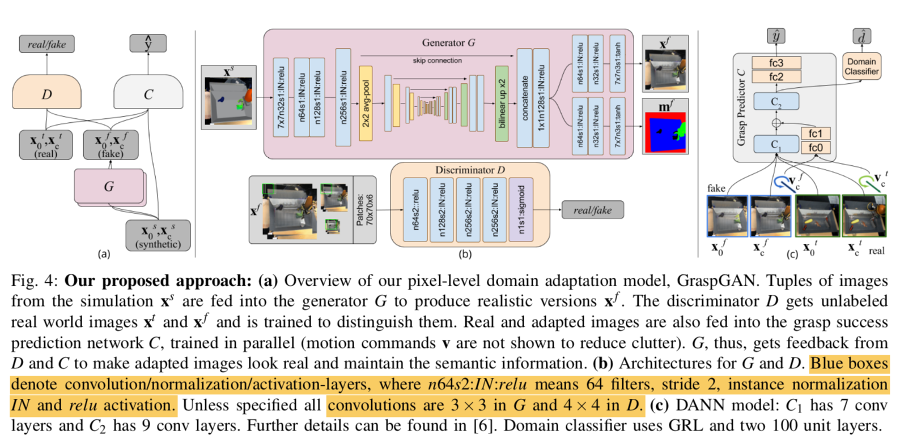

# GraspGAN_DA
Using GraspGAN to do domain adaptation between simulation and real world as described in "Using Simulation and Domain Adaptation to Improve Efficiency of Deep Robotic Grasping"

# Network Architecture
## G Network:
  A convolutional neural network that follows a U-Net architecture. Key techeniques: average pooling for downsampling; bilinear upsampling; concatenation and 1x1 convolutions for the U-Net skip connections and instance normalization.
  
## D Network:
  A patch-based(pix2pix, patch size 70x70) CNN with 5 convolutional layers. It is fully convolutional on 3 scales(472x472, 236x236, and 118x118) of the two input images-they are stacked into a 6 channels inputs (70x70x6) which are used to produce domain estimates for all patches. 
## C Network and DANN:
  An fully functional task network(C) and DANN are believed to be useful but also quite time-consuming. As for the main purpose is to study the effectiveness of GraspGAN in pixel-level domain adaptation, a partial inplementation of GraspGAN would still be valuable in the sense that we can compare the results to results from other techniques such as CycleGAN. Without the task specific network, the simplified GraspGAN architecture is quite similar to pix2pix network.

